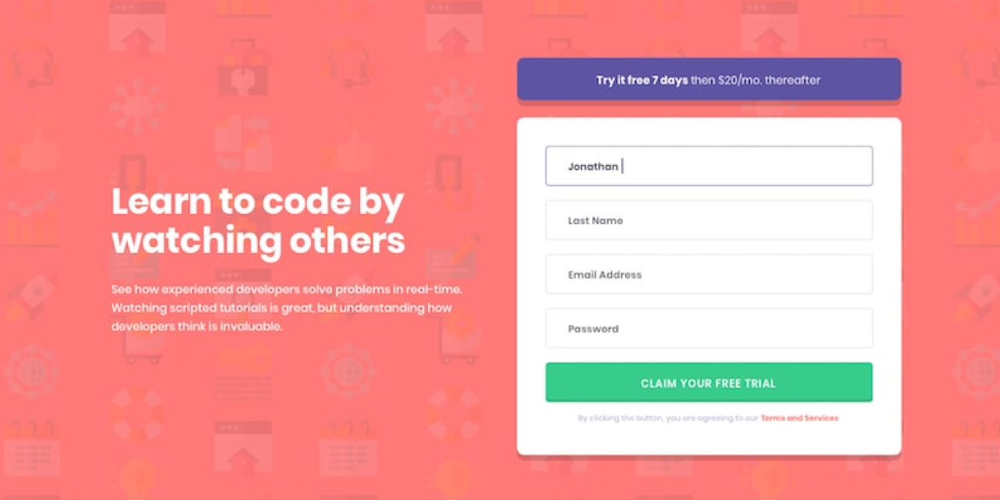

# Frontend Mentor - ???

This is a solution to the [Design preview for the Intro component with sign up form coding challenge](./design/desktop-preview.jpg).
Frontend Mentor challenges help you improve your coding skills by building realistic projects.

## Table of contents

- [Overview](#overview)
  - [The Challenge](#the-challenge)
  - [Screenshot](#screenshot)
  - [Links](#links)
    - [My Process](#my-process)
      - [Build with](#built-with)
      - [What I learned](#what-i-learned)
      - [Continued Development](#continued-development)
      - [Useful Resources](#useful-resources)
- [Author](#author)
- [Acknowledgments](#acknowledgments)

## Overview

### The Challenge

Users should be able to:

- View the optimal layout for the site depending on their device's screen size
- See hover states for all interactive elements on the page
- Receive an error message when the `form` is submitted if:
  - Any `input` field is empty. The message for this error should say _"[Field Name] cannot be empty"_
  - The email address is not formatted correctly (i.e. a correct email address should have this structure: `name@host.tld`). The message for this error should say _"Looks like this is not an email"_

### Screenshot



### Links

- Solution URL: [Solution]()
- Live Site URL: [Live](???)

## My process

### Built with

<!-- - Semantic HTML5 markup
- CSS custom properties
- SASS/SCSS
- JavaScript
- Flexbox
- Responsive Web Design -->

### What I learned

???

```css
???
```

```js
???
```

### Continued development

I'm focusing on improving my programming skills with HTML&CSS and JavaScript. My plan is to get comfortable with the basics before I going to dive into the Frontend framework/library like React, Angular, Vue, etc.
I hope that such amzing tools like [Frontend Mentor](https://www.frontendmentor.io/) and [Uxcel](https://uxcel.com?invite=EE4PBID94EEH) help me with my this.

### Useful resources

[Frontend Mentor](https://www.frontendmentor.io/) - Get a challenge and try to make them as close to a mockup as you can.  
[Uxcel](https://uxcel.com?invite=EE4PBID94EEH) - improv UX/UI Design skills, by reading the article and check your new knowledge by passing a quiz.

## Author

- Website - [Serhii "Gr[i]fano" Orlenko"](https://grifano.webflow.io/)
- Frontend Mentor - [@Grifano](https://www.frontendmentor.io/profile/Grifano)
- Twitter - [@Grifano](https://twitter.com/OrlenkoSerhii)
- LinkedIn - [@Grifano](https://www.linkedin.com/in/serhii-orlenko-44aaa4a3/)

<!-- ## Acknowledgments -->
